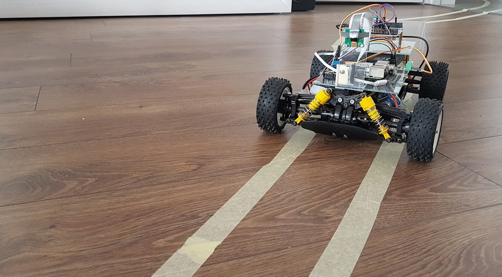
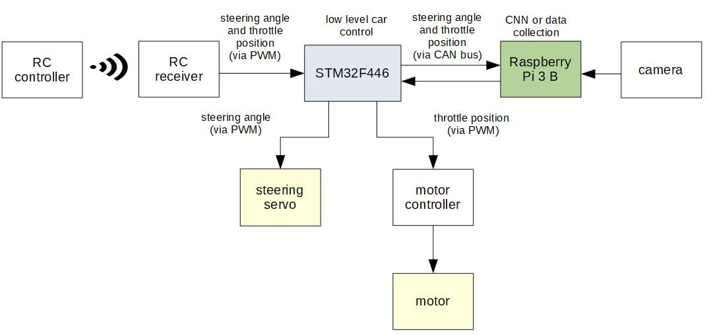
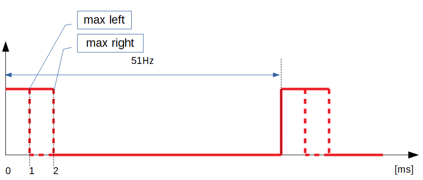
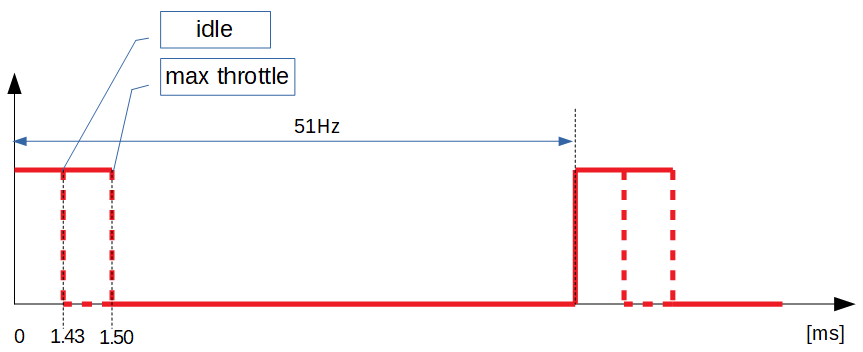
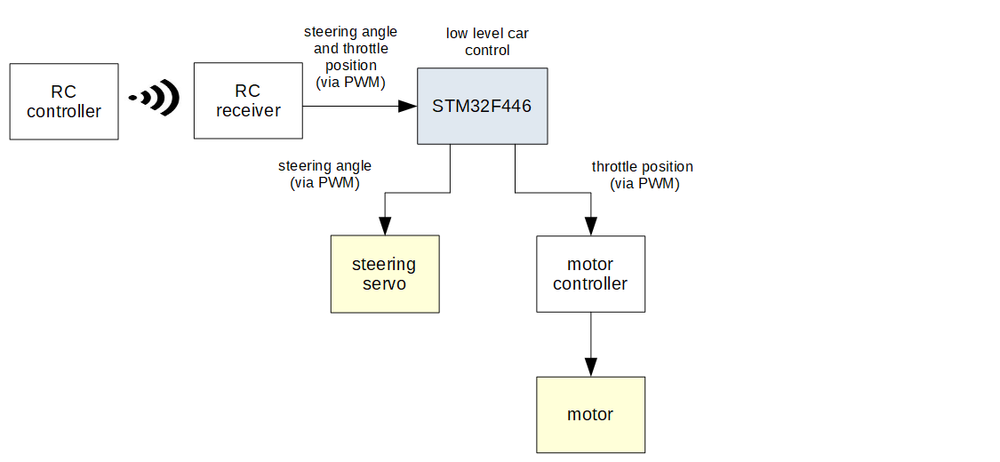
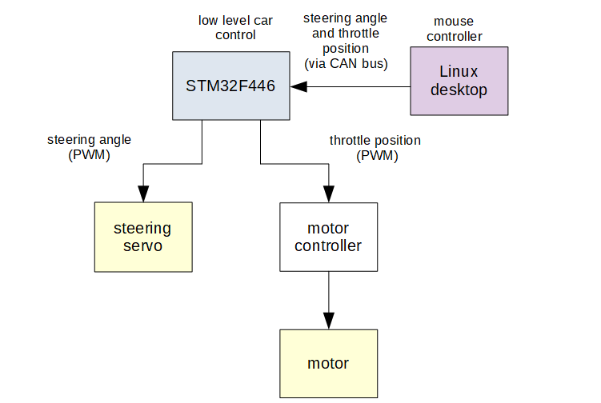
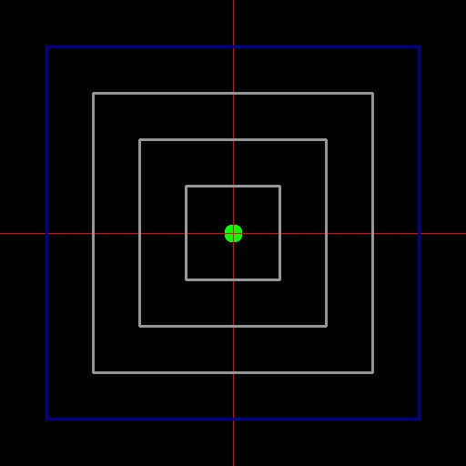
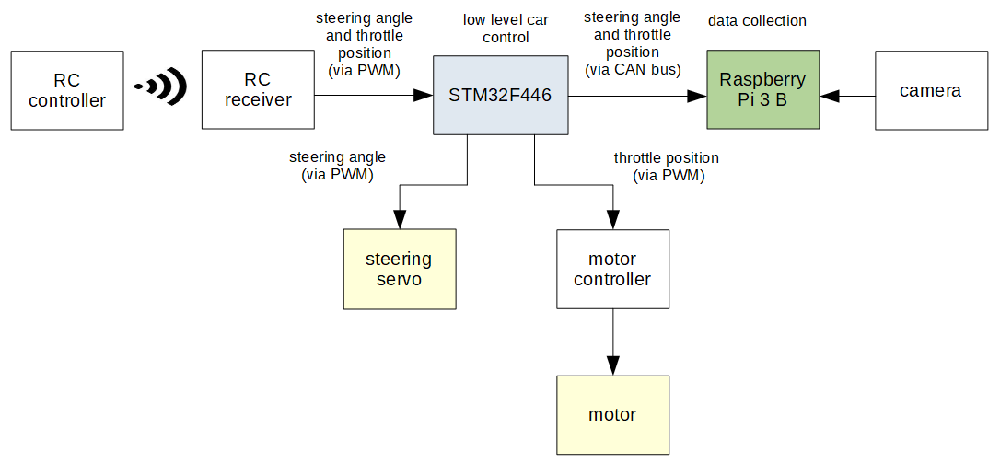
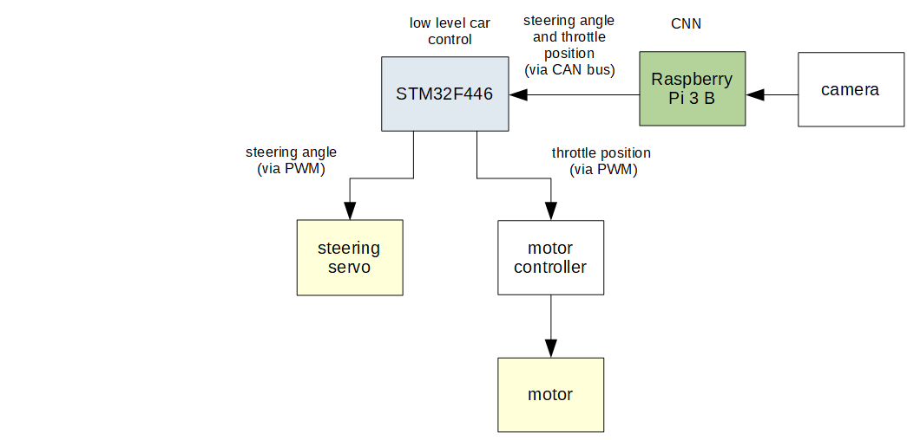

# Self-Driving AI Toy Car

## Key words

C/C++, Python, STM32F446RE, FreeRTOS, Raspberry Pi, Linux, ARM Cortex M4, CAN bus, PWM, UART, socketCAN, TCP socket, multithreading, 
AI, Convolutional Neural Network (CNN), regression, Machine Learning (ML), autonomous car, Numpy, OpenCV, 
Tensorflow on GPU, Keras, Tensorflow Lite, model quantization, Network File System (NFS), SSH, … .

  
  <figcaption>GIF: Self-driving AI toy car</figcaption>

## Table of contents
- <a href="#project_description" >Project Description</a>
- <a href="#relewant_equipment_information" >Relevant Information On Equipment </a>
- <a href="#manual_mode" >Manual Mode</a>
- <a href="#hardware_and_software_basic_test" >Hardware & Software Basic Test</a>
- <a href="#data_collection" >Data Collection</a>
- <a href="#network_architecture_and_training" >Network architecture and training</a>
- <a href="#autonomous_mode" >Autonomous Mode</a>
- <a href="#future_improvements" >Future Improvements</a>

## Project Description

This is a hobby project of a Self-Driving AI Toy Car. It uses Raspberry Pi (RPI) with Raspbian utilizing Convolutional Neural Network (CNN) as the self driving car computer. Second board is STM32F446RE Nucleo with FreeRTOS for low level car controlling. CNN model building and training is based on [*End to End Learning for Self-Driving Cars*](https://images.nvidia.com/content/tegra/automotive/images/2016/solutions/pdf/end-to-end-dl-using-px.pdf) papers from NVIDIA (called NVIDIA papers). The one and only sensing element is a front camera. The model learns useful track features looking at track images with belonging steering angle and throttle position, so that the CNN knows, when to turn or slow down. There are no track features learned explicitly. At this stage of the project the car follows a track marked with two lines and brakes before three transverse lines, as shown in the GIF above.

  
  <figcaption>Figure: AI Toy Car</figcaption>

As mentioned before, the STM32F446RE Nucleo board is used for low level car controlling. The car can be set into three different modes by pressing the blue user button. The modes are: manual mode, data collection mode and 
autonomous mode. Depending on the chosen mode the FreeRTOS application is responsible for different tasks described 
later in this text.

The picture below shows equipment arrangement. The boards are placed on two plates made of plexiglass and are supplied by a power bank located below the STM32F446RE Nucleo board. The front camera is mounted on a rack made from the plexiglass as well.

  
  <figcaption>Figure: Top view</figcaption>

The block diagram below shows the big picture approach to the hardware implementation.

  
  <figcaption>Figure: Self-driving AI Toy Car block diagram</figcaption>

## Relevant Information On Equipment

**Interconnections**

Following table shows hardware interconnection outgoing from the STM32F446RE Nucleo board.

| STM32F446RE GPIO | DESCRIPTION                 | DESTINATION       |
| ---------------- |-----------------------------| ----------------- |
| PA0 (TIM5 CH1)   | steering angle (via PWM)    | steering servo    |
| PA2 (STLink)     | UART2 Tx                    | USB on Linux Host |
| PA3 (STLink)     | UART2 Rx                    | USB on Linux Host |
| PA5 (TIM2 CH1)   | throttle position (via PWM) | motor controller  |
| PA11 (CAN1 Rx)   | steering angle and throttle position (via CAN bus) | Raspberry Pi (USB-CAN converter) |
| PA12 (CAN1 Tx)   | steering angle and throttle position (via CAN bus) | Raspberry Pi (USB-CAN converter) |
| PB5 (TIM3 CH2)   | throttle position (via PWM) | RC receiver    |
| PB7 (TIM4 CH2)   | steering angle (via PWM)    | RC receiver    |

\
**PWM singls for steering angle and throttle position**

Data sent via PWM contains steering angle and throttle position. The PWM signals are sent either from RC receiver to the STM32F446RE or from the STM32F446RE to servo or motor controller. The PWM signals have constant period of 51 Hz.

The trend below shows, that 1 ms duty cycle of steering signal corresponds to the maximum left position of the front wheels and 2 ms duty cycle corresponds to the maximum right position.

  
  <figcaption>Figure: PWM signal for steering angle</figcaption>

The trend below shows, that 1.43 ms duty cycle of throttle signal corresponds to the idle state of the car and 1.50 ms duty cycle corresponds to the maximum speed.

  
  <figcaption>Figure: PWM signal for throttle position</figcaption>

Before usage in the software, the valuses given in milliseconds are converted into timer ticks as shwon in the following table. Conversion factor is made of _CPU clock / timer prescaler = 16 000 000 / 10 = 1 600 000_.

It is worth to notify the values given in Timer Ticks from the table below to avoid confusion during analysis of the code.

| Descritption | Value in ms | Conversion Factor | Value in Timer Ticks |
| ------------ | :-----------: | :-----------------: | :--------------------: |
| steering angle in max. left position | 1 | 1 600 000         |  3200                |
| steering angle in max. right position | 2 | 1 600 000        |  1600                |
| throttle in idle position | 1.43 | 1 600 000   |  2300                |
| throttle in max. forward position| 1.5 | 1 600 000 | 2400              |

\
At this stage of the project there is no closed loop speed controller (e.g. PID controller) implemented. Battery voltage drop or change of the road slope cause speed variation or even car stopping. For this reason the closed loop speed controller is crucial for further functionality extension of the Self-Driving AI Toy Car.

## Manual mode

The car in the manual mode behaves itself like a regular remote controlled toy car. Steering angle and throttle position signals are sent from the RC controller (transmitter) to the RC receiver and then sent as PWM signals to the STM32F446RE board. In this mode the STM32F446RE works as a bypass, so it reproduces the received PWM signals at the output pins, which are connected to steering servo and motor controller.

  
  <figcaption>Figure: High-level view of manual mode</figcaption>

\
**Raspberry Pi in manual mode**

Raspberry Pi in manual mode is not used.

\
**STM32F446RE in manual mode**

Setting of steering angle is carried out as following: 

1. Interrupt handler _TIM4_IRQHandler(void)_
    - reads steer position (steer duty cycle) generated by channel 1 of RC receiver connected to GPIO PB7
    - sets global variable _steer_duty_cycle_
    - notifies _vTask1_remote_ctrl_steer_to_car_ task
   
2. Task _vTask1_remote_ctrl_steer_to_car(void*)_
    - sets duty cycle of PWM output at PA0 pin with _set_pwm_duty_of_PA0_output(steer_duty_cycle)_ function

\
Setting of throttle position is carried out as following: 

1. Interrupt handler _TIM3_IRQHandler(void)_
    - reads throttle position (throttle duty cycle) generated by channel 2 of RC receiver connected to GPIO PB5
    - sets global variable _throttle_duty_cycle_
    - notifies _vTask2_remote_ctrl_throttle_to_car_and_CAN_ task
   
2. Task _vTask2_remote_ctrl_throttle_to_car_and_CAN(void*)_
    - sets duty cycle of PWM output at PA5 pin using _set_pwm_duty_of_PA5_output(steer_duty_cycle)_ function
    - (note: the task sends steer and throttle values over CAN bus if car in data collection mode)

\
**Getting started manual mode**

Upload the [FreeRTOS](FreeRTOS_part) application to STM32F446RE and set the car into the manual mode using the user button (green LED blinks once). No Raspberry Pi application is required.
   

## Hardware & Software Basic Test

Before running any sophisticated software it is important to check hardware and software cooperation on a simple program, that allows easier error tracking in both hardware and software parts of the project. For this reason a mouse controller is developed with OpenCV in Python, that enables controlling of the car by mouse from Linux desktop. As shown in the block diagram below, the connection of the Linux host and the STM32F446RE Nucleo board is set up via CAN bus (using USB-CAN converter).

  
  <figcaption>Figure: High-level view of of basic test</figcaption>

  
  <figcaption>Figure: User Interface</figcaption>

The following GIF shows that communication between the Linux host and the STM32F446RE board is fast and the movements are smooth. Additionally no delay can be seen by moving the mouse with reasonable speed. Summarizing: pre-requirements for application of more advanced programs are fulfilled.

  
  <figcaption>GIF: Mouse controller</figcaption>

\
**Getting started hardware & software basic test**

Upload the [FreeRTOS](FreeRTOS_part) application to STM32F446RE and run it in the autonomous mode (LED blinks three times). 
Then follow the guideline for Hardware & Software Basic Test [here](Linux_part/mouse_controller).

## Data collection
The car in data collection mode is controlled by RC controller but in addition to the regular remote controlled car behavior, STM32F446RE sends actual steering angle and throttle position to Raspberry Pi over CAN bus. The steering and throttle values are required for labeling of frames taken by the camera.  

The training data was collected at home. Data variations were achieved through different paths marked with painter’s masking tape, diverse set of lighting condition and different floor texture through the rooms.

  
  <figcaption>Figure: High-level view of data collection mode</figcaption>

\
**Raspberry Pi in data collection mode**

There are two applications running on RPI when collecting training data. The first is written in C and it builds a server using both socketCAN for taking steering and throttle values from STM32F446RE and a TCP socket for communication with the second application written in Python. The second application utilizes front camera for taking pictures and saves them with names composed of the received steering and throttle values. It means, that each image in the training data set is labeled with steering and throttle position and additionally with date, time and randomly generated unique number. Sample rate is approximately 10 FPS and according to NVIDIA papers higher rate in including images, that are highly similar, does not provide much useful information.

\
**FreeRTOS in data collection mode**

Setting of steering angle is carried out as following:

1. Interrupt handler _TIM4_IRQHandler(void)_
    - reads steer position (steer duty cycle) generated by channel 1 of RC receiver connected to GPIO PB7 
    - sets global variable steer_duty_cycle
    - notifies _vTask1_remote_ctrl_steer_to_car_ task
2. Task _vTask1_remote_ctrl_steer_to_car(void*)_
    - sets duty cycle of PWM output at PA0 pin using set_pwm_duty_of_PA0_output(steer_duty_cycle) function
3. sending _steer_duty_cycle_ in _vTask2_remote_ctrl_throttle_to_car_and_CAN(void*)_

Setting of throttle position is carried out as following:

1. Interrupt handler _TIM3_IRQHandler(void)_
    - reads throttle position (throttle duty cycle) generated by channel 2 of RC receiver connected to GPIO PB5
    - sets global variable _throttle_duty_cycle_
    - notifies _vTask2_remote_ctrl_throttle_to_car_and_CAN_ task
2.  Task _vTask2_remote_ctrl_throttle_to_car_and_CAN(void*)_
    - sets duty cycle of PWM output at PA5 pin using _set_pwm_duty_of_PA5_output(steer_duty_cycle)_ function
3. sending _throttle_duty_cycle_ in _vTask2_remote_ctrl_throttle_to_car_and_CAN(void*)_

\
**Getting started data collection**

Upload the [FreeRTOS](FreeRTOS_part) application to STM32F446RE and set the car into the data collection mode using the user button (green LED blinks twice). Then follow the guideline for Data Collection [here](Linux_part/data_collection_mode).

## Network architecture and training

Each CNN training requires properly prepared training data set. All images with no traversal lines and no car movement at the same time have to be deleted. No artificial shifts and rotations are added to the data set.

The network architecture is chosen experimentally. Selection criteria is not only accuracy but also FPS rate.  It turns out that the car can follow the line with 80% accuracy and 15 FPS much better than with 90% accuracy but only 5 FPS. The reason is that the reaction of the CNN model running with 5 FPS is often outdated and the calculation results expire before occurring at the CNN output. Not only network size played a significant role in speed gaining, but also the model quantization. The CNN is built on a regular PC using Keras with GPU-Tensorflow in back-end and then quantized using Tensorflow Lite.

The CNN network is made of three convolutional layers with max pooling in-between and then with 5 fully connected layers. Output layer has two neurons – one for steering angle and one for throttle position.

The network was trained to minimize the mean square error between steering & throttle pairs at CNN output and steering & throttle pairs given by human during data set collection. 

Take a look into the [notebook](Linux_part/cnn_building/cnn_building.ipynb) for detailed information. 

## Autonomous mode

The car in the autonomous mode is fully controlled by RPI. The task of the trained CNN is to drive the car on the path marked with two lines and to brake before three transverse lines. 

  
  <figcaption>Figure: High-level view of autonomous mode</figcaption>

**Raspberry Pi in autonomous mode**

There are two applications dedicated to the autonomous mode on RPI. The first is written in Python and runs the trained CNN and additionally builds a TCP client connected to the server written in C. The Python application takes pictures using the front camera, does some image preprocessing and provides them to the CNN input. The CNN calculates steering angle and throttle position, that are sent over TCP socket to the server. The server sends the steering position and throttle values in one message over CAN bus to the STM32F446RE board.

\
**FreeRTOS in autonomous mode**

Setting steer and throttle position is carried out as following:

1. Interrupt handler _CAN1_RX0_IRQHandler(void)_
   - notifies _vTask4_can_ctrl_to_car_ task if message received 
2. Task _vTask4_can_ctrl_to_car(void*)_
   - sets global variable _steer_duty_cycle_ and _throttle_duty_cycle_ using _can1_receive()_ function
   - sets duty cycle of PWM output at PA0 pin using _set_pwm_duty_of_PA0_output(steer_duty_cycle)_ function
   - sets duty cycle of PWM output at PA5 pin using _set_pwm_duty_of_PA5_output(steer_duty_cycle)_ function

\
**Getting started autonomous mode**

Upload the [FreeRTOS](FreeRTOS_part) application to STM32F446RE and set the car into the autonomous mode using the user button (LED blinks three times). Then follow the guideline for the autonomous mode [here](Linux_part/autonomous_mode).

## Future improvements

- wide angle camera
- closed loop speed control (e.g. PID)
- functionality extension (road signs detection, semi-autonomous mode, interaction with other cars, ...)
- transition to NVIDIA Jetson
- more diverse dataset
- many, many others

